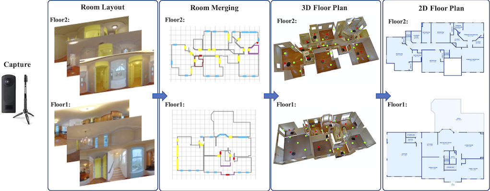

# Zillow Indoor Dataset (ZInD)



The Zillow Indoor Dataset (ZInD) provides extensive visual data that covers a real world distribution of unfurnished residential homes. It consists of primary 360º panoramas with annotated room layouts, windows, doors and openings (W/D/O), merged rooms, secondary localized panoramas, and final 2D floor plans. The figure above illustrates the various representations (from left to right beyond capture): Room layout with W/D/O annotations, merged layouts, 3D textured mesh, and final 2D floor plan.

Definitions: *Primary* panoramas are those selected by annotators as having the "best" views of entire rooms, and are used to generate room layouts. The rest of the panoramas are *secondary* panoramas, which are provided for denser spatial data; they are localized within room layouts using a semi-automatic approach. An *opening* is an artificial construct that divides a large room into multiple parts. Note that openings are later processed for removal.

## Paper

Zillow Indoor Dataset: Annotated Floor Plans With 360º Panoramas and 3D Room Layouts

[Steve Cruz](https://www.linkedin.com/in/stevecruz)\*,
[Will Hutchcroft](https://www.linkedin.com/in/willhutchcroft)\*,
[Yuguang Li](https://www.linkedin.com/in/yuguang-lee-48700a58/),
[Naji Khosravan](https://www.linkedin.com/in/naji-khosravan-517a2376),
[Ivaylo Boyadzhiev](https://www.linkedin.com/in/ivaylo-boyadzhiev),
[Sing Bing Kang](http://www.singbingkang.com/)

Proceedings of the IEEE Conference on Computer Vision and Pattern Recognition (CVPR), 2021

[[Paper](https://openaccess.thecvf.com/content/CVPR2021/papers/Cruz_Zillow_Indoor_Dataset_Annotated_Floor_Plans_With_360deg_Panoramas_and_CVPR_2021_paper.pdf)]
[[Supplementary Material](https://openaccess.thecvf.com/content/CVPR2021/supplemental/Cruz_Zillow_Indoor_Dataset_CVPR_2021_supplemental.pdf)]

(\* Equal contribution)

If you use the ZInD data or code please cite:

```bibtex
@inproceedings{ZInD,
  title     = {Zillow Indoor Dataset: Annotated Floor Plans With 360º Panoramas and 3D Room Layouts},
  author    = {Cruz, Steve and Hutchcroft, Will and Li, Yuguang and Khosravan, Naji and Boyadzhiev, Ivaylo and Kang, Sing Bing},
  booktitle = {Proceedings of the IEEE Conference on Computer Vision and Pattern Recognition (CVPR))},
  year      = {2021}
}
```

## Data

### Overview
ZInD is an RGB 360º panoramas dataset containing 71,474 panoramas taken in 1,524 unfurnished residential homes, annotated with 3D room layouts, 2D bounding boxes for W/D/O, merged room layouts, 3D camera poses, and final 2D floor plans.
Please refer to [data organization](data_organization.md) for more details.

### Capture Process
To capture home interiors at scale, we opted for sparse 360º panorama capture of every room in the home using an off-the-shelf 360º camera (such as Ricoh Theta V or Z1) paired with an iPhone. To do so, photographers across 20 US cities and 12 states were hired to do the capture; they were given specific instructions to ensure uniformity in the capture quality. Please see the [FAQ](#what-was-the-capture-protocol) section for more details.

### Annotation Pipeline
The 3D floor plans were generated from a sparse set of RGB panoramas using our proprietary human-in-the-loop pipeline. Please see the [FAQ](#what-was-the-annotation-pipeline) section for more details.

### Download :construction:

> Coming Early July

#### Preregistration
If you are interested in downloading ZInD, please register an account on the [Bridge Platform](https://bridgedataoutput.com/register/zgindoor). During registration you will be required to agree to the [Zillow Data Terms of Use](https://bridgedataoutput.com/zillowterms). Before you take all these steps, however, we strongly suggest that you review the [FAQ](#what-are-the-conditions-for-using-zind) section first. Once ZInD is available for download, you will be notified.

For non-commercial, academic institutions outside US and Canada, please select Other as a State/Province.

#### Batch Download

We will provide a script that will automatically download the data from the [Bridge Platform](https://bridgedataoutput.com/register/zgindoor), there is no need for you to interact with the API directly.

### Properties and Stats :construction:

> Coming Early July

## Tools :construction:

> Coming Early July

### Visualization :construction:

> Coming Early July

## License

The data is released under the [ZInD Terms of Use](https://bridgedataoutput.com/zillowterms), and the code is released under the [Apache License](LICENSE).

## Contact

[ZInD@zillowgroup.com](mailto:ZInD@zillowgroup.com)

## Acknowledgement

We would like to thank the Zillow RMX engineering team for building the annotation infrastructure, and the ZO photographers for capturing the empty homes.
We are grateful to Pierre Moulon and Lambert Wixson for discussions on ZInD. In addition, Ethan Wan has been very helpful in processing and validating data in preparation for release.
Finally, the Bridge team has also been instrumental in making ZInD release a reality.

## Frequently Asked Questions

- [Can ZInD be downloaded free-of-charge?](#spell-check-doesnt-work-how-do-i-enable-it)
- [What are the conditions for using ZInD?](#what-are-the-conditions-for-using-zind)
- [What are the important issues associated with the dataset that we need to be aware of?](#what-are-the-important-issues-associated-with-the-dataset-that-we-need-to-be-aware-of)
- [What was the capture protocol?](#what-was-the-capture-protocol)
- [What was the annotation pipeline?](#what-was-the-annotation-pipeline)

## Can ZInD be downloaded free-of-charge?

Yes, ZInD is free of charge for academic, non-commercial use.

## What are the conditions for using ZInD?

Zillow licenses ZInD for academic use only. ZInD is **not** licensed for commercial purposes. Here are some examples of what are acceptable and unacceptable uses of ZInD:
  - *Acceptable use*: You are a researcher (e.g., graduate student, post-doc, professor) at a university, and are using ZInD to investigate potentially new ideas on room shape and floor plan generation from panoramas. You publish a paper based on that research work, and use images and derived data from ZInD.
  - *Possible acceptable use*: You work at a non-academic institution, and you are writing a paper on estimating room shapes from images. You use ZInD as one benchmark, and publish a paper to show the effectiveness of your algorithm. None of that work will be used in any product at your company. Here, you will not be able to license ZInD via Zillow Bridge API, but will need to contact us first with a proposal (500 words minimum). You can contact us for approval of your proposal by emailing your proposal to [ZInD@zillowgroup.com](mailto:ZInD@zillowgroup.com).
  - *Unacceptable use*: You work at a non-academic institution, and you use data from ZInD to improve algorithms in a product or service.
  - *Unacceptable use*: You are a researcher at a university, and you collaborate with someone who works at a non-academic institution. While your main goal is to publish a paper, the results of your work based on ZInD data are incorporated in a product or service at that company.

## What are the important issues associated with the dataset that we need to be aware of?

Given the manner in which the panoramas were captured and annotated, there are specific characteristics that needed to taken into consideration. Details can be found in the CVPR 2021 paper. Here we list some notable features/issues:
  - Visible geometry will not be available for very small rooms (e.g., closets), where the panorama is captured *outside* such a room.
  - Small amount of annotation errors might be present in all tasks, like room shapes, WDO boundaries and secondary panorama localization.
  - There are occasional, pre-redraw, artifacts due to separating the annotation tasks, such as door dimensions not matching exactly at adjacent rooms.   
  - Once in a while, the IMU data and/or our upright correction algorithm fails, resulting in a panorama that is tilted.
  - For complex (non-flat) ceilings, the given height is only an approximation.
  - For "visible" geometry, note that partially visible geometries are locally clamped to what is observable, so that the extracted geometry would no longer be Manhattan (assuming the original room layout is).
  - "Complete" and "visible" geometry will not extend through doors, but only openings, since we don't collect annotations on whether a door is closed or open.
  - The merger (pre-redraw) geometry and the final redraw geometry would not align perfectly due to the final human touch up in redraw to create a polished and globally consistent floor plan.   

## What was the capture protocol?

To enable capturing entire home interiors at scale, we opted for sparse 360º panorama capture of every room in the home using an off-the-shelf 360º camera (such as Ricoh Theta V or Z1) paired with an iPhone. Photographers across 20 US cities were hired to do the capture. To ensure consistency in the capture process, they were given specific instructions, which include:
1. Capture every room, including connecting hallways and garages.
2. Keep a fixed tripod height within a home.
3. Capture a calibration target to allow camera height to be computed.
4. Keep interior doors open whenever possible.
5. Turn on all lights and turn off fans and TVs.
6. Avoid capturing personal information (such as people, photographs of people, pets, and objects).

Please refer to the [Supplementary Material](https://openaccess.thecvf.com/content/CVPR2021/supplemental/Cruz_Zillow_Indoor_Dataset_CVPR_2021_supplemental.pdf) for more details.

## What was the annotation pipeline?

To generate 3D floor plans from a sparse set of RGB panoramas, we developed a proprietary human-in-the-loop pipeline. Our pipeline starts with automatic pre-processing of panoramas, which includes straightening, room layout estimation, and W/D/O detection. Subsequently, trained annotators are tasked with:
1. Selecting, verifying, and correcting primary room layouts and W/D/O features.
2. Merging verified primary room layouts to form a draft floor plan.
3. Localizing secondary panoramas within the existing, primary layouts.
4. Fixing and cleaning up the draft 2D floor plan to generate the final version.

Please refer to the [Supplementary Material](https://openaccess.thecvf.com/content/CVPR2021/supplemental/Cruz_Zillow_Indoor_Dataset_CVPR_2021_supplemental.pdf) for more details.

## What was the post-processing protocol?

To reduce privacy concerns, we have automatically detected and removed any panoramas that contain:
1. People or photographs of people to avoid sharing PI or PII information.
2. Significant outdoor view, to avoid sharing street views or neighbouring properties.
