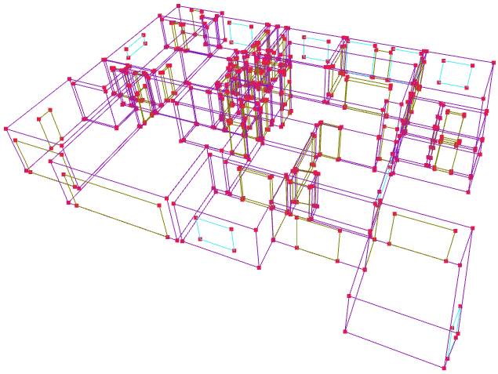
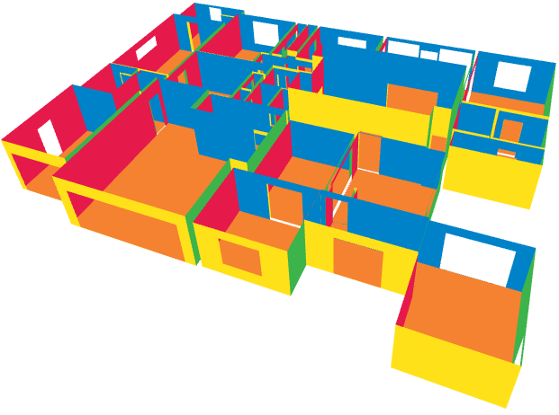
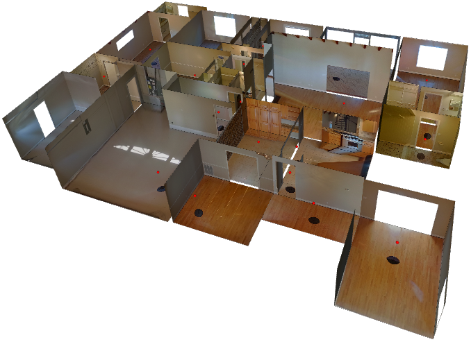

# Structured3D Conversion & Visualization

| Wireframe                             | Plane                         | Mesh                             |
| ------------------------------------- | ----------------------------- | ------------------------------------- |
|  |  |  |

## Structure3D

Structured3D is a large-scale photo-realistic dataset containing 3.5K house designs proposed in a ECCV'20 [paper](https://www.ecva.net/papers/eccv_2020/papers_ECCV/papers/123540494.pdf). To extend the compatibility 
and potential applications of our ZInD dataset, we provided python scripts which converts original ZInD data format
to Structure3D format with minimal modifications, and rendering the converted samples for visualization purpose. The modifications are due to a few extra components (e.g., windows, 
doors, and openings). In addition, we further provided the modified visualization scripts for visualizing the converted
ZInD samples in interactive manner.

More details of Structure3D could be found in the [GitHub](https://github.com/bertjiazheng/Structured3D) page.


## ZInD to Structure3D Conversion

### Requirements
The python script export_structure3d_clp.py converts the ZInD data formats to Structure3D. It requires a few extra
dependencies and utils.py, pano_image.py, and transformations.py in ./code.

To run the code, a few general steps are list below:

* Setup ZInD in original repo
* Setup the requirements.txt
* Run the conversion code and save the converted files

### Run the code
The input parameters of export_structure3d_clp.py are the folder contains the ZInD samples and the target folder export the converted
samples. An example is provided below:
```
python export_structure3d_cli.py -i <input_folder> -o <output_folder>
```
Example names of the output file are "scene_00140" and "scene_oo141", where the first 4 digits corresponding to the ZInD
scene name "0014", and the last digit is the floor index which is various depend on different scenes.

## Structure3D Rendering

### Installation
The rendering code is slightly modified based on the original version. The installation requirement is the same. Please
follow the installation instruction in this [GitHub](https://github.com/bertjiazheng/Structured3D) to install the complete
dependencies.

After the setup, the code could be run directly, the general pipeline:
* Finished the first conversion steps and get the converted samples
* Setup Structure3D environment in [GitHub](https://github.com/bertjiazheng/Structured3D)
* Run the rendering code

### Run the code
After the installation, there are two scripts for rendering (visualize_3d.py and visualize_mesh.py) which could be 
run directly. The specifically instructions are listed below:

* **visualize_3d.py** is used for rendering the wireframe and plane mode. Only the structural information from .json file
is required and loaded in this pipeline. The input parameters are converted Structure3D
folder and the scene number which is used for rendering. Then, select the rendering type. An interaction window
open3D window will popup. 
```
python visualize_3d.py --path /path/to/dataset --scene scene_id --type wireframe/plane
```

* **visualize_mesh.py** renders the home with textures which is extracted from the panorama images. Both the structural
.json file and panorama images are loaded. The panorama images are cropped to generate the texture of corresponding walls,
ceilings, and floors. Similar as above script, the input parameters are the folder, and the scene number which is used for rendering. Then, select the rendering type. An interaction window
open3D window will popup.
```
python visualize_mesh.py --path /path/to/dataset --scene scene_id
```


